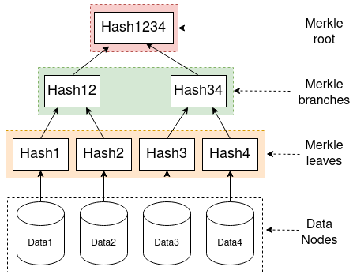

# How Merkle Proof Works

You have millions of unique images in your gallery, each representing a piece of private or personal data stored on your phone. After an incident, you lost your device, but it was returned to you after many months, with claims that the images hadn't been tampered with.

Verifying the authenticity of each image in this gallery could be difficult, right? How can they prove the images haven't been manipulated, or how can you confirm everything is as it should be? That's where **Merkle's proofs** come into play, as they offer a solution to verify the integrity of large datasets without the need to inspect each item individually.

In this tutorial, you will learn about Merkle proofs, how to create them using a [Merkle Tree](https://en.wikipedia.org/wiki/Merkle_tree), and how to implement Merkle proofs for whitelisting email addresses using JavaScript.

To understand how Merkle proofs help verify the authenticity and integrity of your data without the need to check each piece individually, such as your image gallery, as discussed earlier, you first need to understand the structure that underpins them: the **Merkle Tree**.

## What is a Merkle Tree?

A [Merkle Tree](https://en.wikipedia.org/wiki/Merkle_tree), also known as a hash tree, is a binary tree structure used to verify a data set's integrity effectively. It was a concept named after the computer scientist [Ralph Merkle](https://en.wikipedia.org/wiki/Ralph_Merkle), who patented it in 1979.

This binary tree structure has each leaf node representing a block of data or a piece of information. Instead of containing the data directly, the internal nodes hold a cryptographic hash of their child nodes. The tree is built by repeatedly hashing pairs of child nodes until a single root hash is achieved.

## Components of Merkle Tree



_Merkle Tree image by Teemu Kanstrén_

A Merkle tree has three different components, as shown in the image above Merkle root, Merkle branches, and Merkle leaves. Let's take a look at what they are.

- **Merkle root** is derived from hashing together the child hashes beneath it and down to the leaves. It is a single hash on its own that represents the top of the Merkle tree, as shown in the image above and is often used to store block headers in [blockchain](https://en.wikipedia.org/wiki/Blockchain) content without downloading the entire block.
- In a Merkle tree, we have **Merkle branches**, intermediate nodes between Merkle roots and Merkle leaves. Each branch node is created by hashing together the hashes of its child nodes. These branches form the connections between the leaves (where the data resides) and the Merkle root, making it easier to ensure that the Merkle tree can be efficiently traversed and verified.
- **Merkle leaves** are the nodes at the bottom layer of the Merkle tree. They contain hashes of the actual data stored. The leaves are the foundation of the Merkle tree, as their hashes are combined and rehashed to produce the hashes of the nodes above them, ultimately leading to the Merkle root.

Additionally, we have the **Data nodes**, a layer representing how data is supplied to start the process before it hashed in the next layer(Merkle leaves), which is the Merkle leaves, as shown in the image.

## What is a Merkle Proof?

A Merkle proof is a method used to verify the presence and integrity of specific data within a dataset using a Merkle tree. It comprises a single data block (leaf), a series of hashes from the tree (branches), and the Merkle root.

While Merkle proof is used to verify the presence of specific data within a dataset using a Merkle tree, here are some areas where Merkle proof can be applied.

- In a distributed system for data verification
- Secure communication protocols
- Data storage solution
- Cryptocurrencies and blockchain

## Implementing a Merkle Proof for Whitelisting Email Addresses

Let's implement a Merkle proof for whitelisting email addresses in this section.

### Prerequisite

- [Node.js](https://nodejs.org/en/) and its package manager NPM, version 18. Verify Node.js is installed by running the following terminal command: `node -v && npm -v`
- A basic understanding of [JavaScript](https://www.w3schools.com/js/default.asp)

### Project Setup and Installation

Navigate to any directory of your choice, and then run the following commands to create a new folder and change the directory into the folder:

```bash
mkdir merkle-proof-tutorial
cd merkle-proof-tutorial
```

Next, you need to install the `merkletreejs` and `crypto-js` libraries, which will be needed to create a Merkle tree and hash data using the following command:

```bash
npm i merkletreejs crypto-js
```

Create a new file `proof.js` feel free to name it whatever you want, but for this tutorial, you will name it `proof.js`.

### Import Libraries

You will be using the `merkletreejs` and `crypto-js` libraries in this example to create a Merkle tree and hash the data, respectively.

Navigate into the `proof.js` file and add the following code snippet:

```javascript
const { MerkleTree } = require("merkletreejs");
const SHA256 = require("crypto-js/sha256");
```

### Create a List of Emails to Be Whitelisted

You need to create a list of emails to be whitelisted. In this example, you will add three emails, but it could be millions of emails, depending on the data you want to test with. Add the following code snippet to create an array of three email addresses:

```javascript
//...

// List of email addresses to be whitelisted
const emails = ["example1@mail.com", "example2@mail.com", "example3@mail.com"];
```

### Convert Emails to Hashes and Build the Merkle Tree

Next, you need to convert each email into a hash and create the Merkle tree using the hashed emails with the following code snippet:

```javascript
//...

// Convert each email into a hash
const leaves = emails.map((email) => SHA256(email));

// Create the Merkle Tree using the hashed emails
const tree = new MerkleTree(leaves, SHA256);

// Get the root and convert it to a hexadecimal string
const root = tree.getRoot().toString("hex");
```

### Function to Verify Whitelisted Emails

In the previous step, you created a tree for the addresses; next, you must create a function to prove if an email is part of the whitelisted emails.

Create a function `verifyEmail`:

```javascript
//...

// Function to verify if an email is whitelisted
const verifyEmail = (email) => {
  // Hash the email to be verified
  const hashedEmail = SHA256(email);

  // Get the proof for the hashed email from the tree
  const proof = tree.getProof(hashedEmail);

  // Verify the proof against the root of the tree; returns true if valid, false otherwise
  const verified = tree.verify(proof, hashedEmail, root);

  // Log the result to the console
  console.log(`${email} is ${verified ? "whitelisted" : "not whitelisted"}.`);
};
```

In the code snippet, you created a function verifying whether an email is whitelisted. To do this, you:

- Hashed the email to be verified using SHA256
- Got the proof for the hashed email using the `getProof` method
- Verified the proof against the root of the tree

Here is what the complete code looks like:

```javascript
const { MerkleTree } = require("merkletreejs");
const SHA256 = require("crypto-js/sha256");

// List of email addresses to be whitelisted
const emails = ["example1@mail.com", "example2@mail.com", "example3@mail.com"];

// Convert each email into a hash
const leaves = emails.map((email) => SHA256(email));

// Create the Merkle Tree using the hashed emails
const tree = new MerkleTree(leaves, SHA256);

// Get the root and convert it to a hexadecimal string
const root = tree.getRoot().toString("hex");

// Function to verify if an email is whitelisted
const verifyEmail = (email) => {
  // Hash the email to be verified
  const hashedEmail = SHA256(email);

  // Get the proof for the hashed email from the tree
  const proof = tree.getProof(hashedEmail);

  // Verify the proof against the root of the tree; returns true if valid, false otherwise
  const verified = tree.verify(proof, hashedEmail, root);

  // Log the result to the console
  console.log(`${email} is ${verified ? "whitelisted" : "not whitelisted"}.`);
};
```

### Test the Verification Function

In this section, you will test the verification function with a whitelisted and non-whitelisted email.

Test with a whitelisted email address by calling the `verifyEmail` function inside the script file.

```javascript
//...

verifyEmail("example2@mail.com"); // Expected output: "example2@mail.com is whitelisted."
```

To run the script, use the following command:

```bash
node proof.js
```

The result printed on the console will return a response as shown below, indicating the email address is whitelisted because it is part of the emails we added to the email array.

Next, test with an email that is not whitelisted.

```javascript
//...

verifyEmail("x@mail.com"); // Expected output: "x@mail.com is not whitelisted."
```

You should see a response indicating the email is not whitelisted, as shown below. This is because it wasn't part of the emails whitelisted, meaning there is no proof for the email address to indicate it was part of the tree.

## Conclusion

In this tutorial, you learned about Merkle proofs, how they can be used to ensure the integrity of datasets in applications, how to create them using a Merkle Tree, and how to implement Merkle proofs for whitelisting email addresses using JavaScript.

## References

- [Merkle Tree](https://en.wikipedia.org/wiki/Merkle_tree)
- [Merkletreejs SDK](https://www.npmjs.com/package/merkletreejs)
